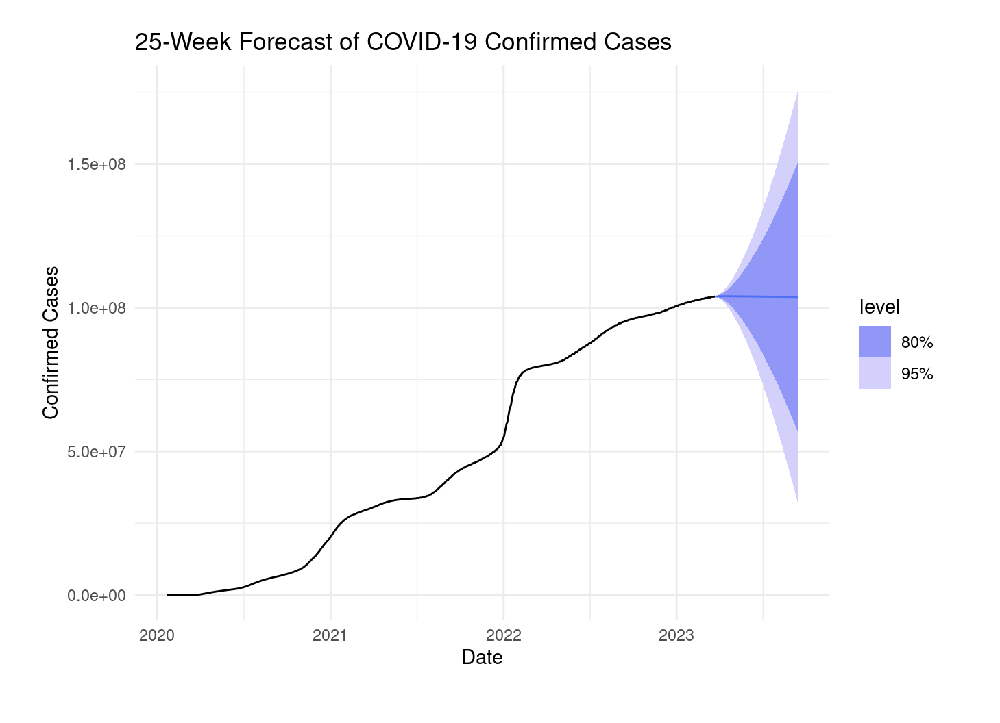

# 📊 U.S. COVID-19 Confirmed Cases Forecasting Project

**Author**: Jullian Alcantara  
**Tools Used**: R, `fpp3`, `COVID19`, `ARIMA`, `STL Decomposition`, `ggplot2`

---

## 📌 Project Overview

This project forecasts daily confirmed COVID-19 cases in the United States using time series modeling. The goal was to identify short-term trends and assess how far into the future forecasts remain reliable for potential public health decision-making.

---

## 🎯 Objective

- Analyze trends, seasonality, and irregularities in daily COVID-19 cases
- Build and compare statistical forecasting models (ARIMA)
- Forecast future confirmed cases and evaluate prediction accuracy over time

---

## 📈 Data Source

- **COVID-19 Data Hub** (Guidotti & Ardia, 2020)  
- Daily U.S. confirmed case counts from **January 21, 2020** to **early 2024**

---

## ⚙️ Methodology

1. **Data Cleaning & Transformation**
   - Converted to time series object
   - Applied square root transformation to stabilize variance  

2. **Trend & Seasonality Analysis**
   - Used **STL decomposition** to visualize trend, yearly, and weekly patterns

3. **Stationarity Testing**
   - Performed KPSS tests and applied first/second differencing to achieve stationarity

4. **Model Selection**
   - Compared ARIMA(3,1,0)(0,1,1) and ARIMA(3,1,0)(1,1,0) based on AICc  
   - Selected ARIMA(3,1,0)(1,1,0) as best model

5. **Residual Diagnostics**
   - Checked for white noise residuals through ACF/PACF, histograms, and residual plots  

6. **Forecasting**
   - Generated a 25-week forecast of daily confirmed cases
   - Evaluated confidence intervals and practical forecast horizon

---

## 📊 Key Findings

- Strong seasonality and multiple waves observed through STL decomposition  
- ARIMA(3,1,0)(1,1,0) model demonstrated the best fit and reliable residual diagnostics  
- **Forecasts are actionable for 4–8 weeks** ahead; intervals widen significantly after this

---

## 📑 Project Deliverables

- 📜 Clean, reproducible R script with annotated code  
- 📊 Forecast visualizations with prediction intervals  
- 📋 Model selection metrics and diagnostic summaries  

---

## 📊 Sample Forecast Plot



> *Forecast of daily U.S. confirmed COVID-19 cases, with 80% and 95% confidence intervals.*

---

## 📚 Learnings

- Practical experience with time series forecasting using R
- Importance of model diagnostics and transformation in volatile data
- Real-world application of statistical models for decision support

---

## 📂 How to Run

```R
# Install required libraries
install.packages("pacman")
pacman::p_load(tidyverse, fpp3, COVID19, ggplot2, fabletools)

# Run the script
source("scripts/covid_forecasting_project.R")
